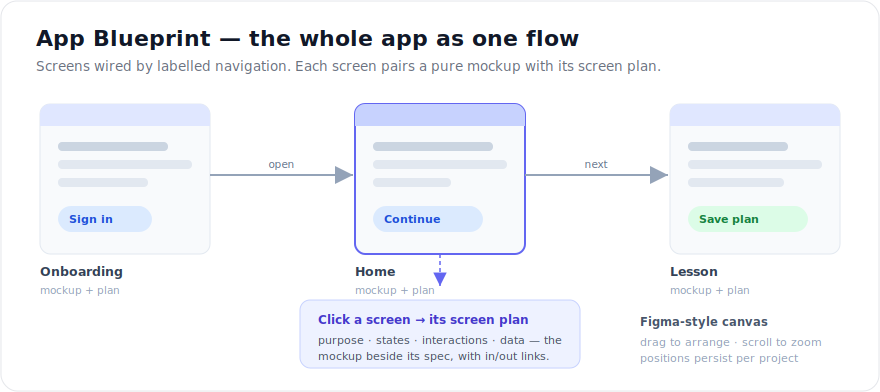
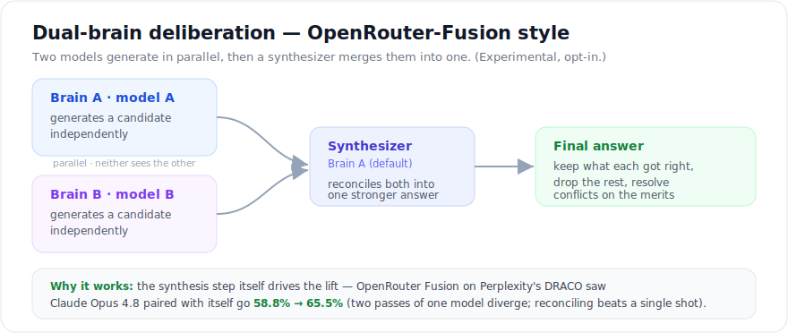

# Workcell

[](./LICENSE)
[](https://nodejs.org)
[](https://pnpm.io)
[](./CONTRIBUTING.md)

**Workcell은 개발 프로젝트 수행에 특화된 멀티에이전트 운영 플랫폼입니다. 사람이 보드(이사회)로서
방향을 정하면, AI 팀 — 오케스트레이터 · 개발자 · 디자이너 · QA — 이 증거와 함께 결과물을
출시합니다.**

[English](./README.md) · [한국어](./README.ko.md) · [日本語](./README.ja.md) · [简体中文](./README.zh-CN.md) · [繁體中文](./README.zh-TW.md) · [Español](./README.es.md) · [Français](./README.fr.md) · [Deutsch](./README.de.md) · [Português (BR)](./README.pt-BR.md) · [Русский](./README.ru.md) · [हिन्दी](./README.hi.md) · [العربية](./README.ar.md) · [Bahasa Indonesia](./README.id.md) · [Italiano](./README.it.md)

당신은 보드로 남습니다: 방향, 승인, 정책을 소유합니다. 에이전트는 기능 역할을 맡아 이슈를
집어 들고, 작업 산출물과 함께 그 작업이 실제로 끝났다는 **증거(proof)** 를 남깁니다. 컨트롤
플레인이 조직 운영 — 프로젝트, 이슈, 예산, 거버넌스, 불변 감사 로그 — 을 담당하는 동안,
당신은 정말 중요한 결정에만 시간을 씁니다.

> 회사처럼 운영하고 · 이슈처럼 실행하고 · 디자인을 source of truth로 삼고 · 판단은 사람이 한다.

---

## 철학

Workcell은 개발 프로젝트가 어떻게 굴러가야 하는지에 대해 뚜렷한 입장을 가진 제품입니다.
네 가지 원칙이 제품 전체를 관통합니다:

### 1. 사람은 방관자가 아니라 보드다

여기에 "무인 회사"는 없습니다. 사람이 방향·승인·정책을 소유하고, 에이전트가 실행을
소유합니다. 중요한 게이트 — 디자인 승인, 증거 검토, 예산, 고용 — 는 전부 사람의 결정으로
끝나며, 불변 감사 로그에 기록됩니다.

### 2. 개발 프로젝트는 진짜 팀이 출시한다

Workcell은 **기본적으로 네 자리를 가지고 갑니다 — 오케스트레이터 · 디자이너 · 개발자 · QA.**
이건 템플릿이 아니라 철학입니다: 아이디어를 design-first로, 모든 게이트에 분명한 주인을 두고
의도에서 증명까지 끌고 갈 수 있는 **가장 작은 팀**이 이 넷입니다.

| 자리 | 역할 | 책임 |
| --- | --- | --- |
| **오케스트레이터** | 라우팅 · 조율 | 자연어를 구조화된 이슈로 변환, 역할에 맞게 작업 분배, 멈춘 run 감시 |
| **디자이너** | `designer` | 디자인 시스템 — 시안 제안, 승인된 source-of-truth 디자인 유지보수 (**디자인이 먼저**) |
| **개발자** | `engineer` | 구현, 디버깅, 테스트 — *승인된* 디자인을 기준으로 빌드(앞서가지 않음) |
| **QA** | `qa` | *Done* 판정 — 재현하고 검증하고 증거에 사인오프 |

온보딩이 오케스트레이터를 만들어 주고, Agents 페이지가 비어 있는 자리를 원클릭 고용으로
보여줍니다. 오케스트레이터의 차터는 코드는 엔지니어에게, UX는 디자이너에게, 검증은 QA에게
라우팅하도록 짜여 있어 — 팀 구성이 문서가 아니라 실제 작업 흐름입니다.

**네 자리는 뼈대일 뿐, 천장이 아닙니다 — 그 위에서 자유롭게 확장합니다.** 작업이 요구하면
역할을 더 고용하고 — **Lead · PM · Researcher · Writer · Security · DevOps · 범용 에이전트** —
어느 에이전트에든 Capability Registry에서 범위 지정된 스킬 · 플러그인 · MCP 서버 · 디자인
시스템을 붙입니다. 이슈의 주인은 단일 에이전트로도, 또는 — 실험적·opt-in — **듀얼 브레인**(두
모델이 병렬 생성 후 합성)으로도 굴립니다. 기본값은 새 프로젝트를 첫날부터 일관되게 유지하고, 조직은 프로젝트에
맞춰 자라납니다 — 그 반대가 아니라.

### 3. 앱 전체를 하나의 기획으로 — 디자인이 source of truth다

프로젝트마다 **전체 앱 기획(App Blueprint)** 이 있습니다: 앱의 모든 화면을 플로우 우선의
Figma 스타일로 보여주는 화면 — 기획과 디자인이 한곳에 삽니다.



- **화면 + 기획, 한 쌍.** 각 화면은 **순수 시안(렌더된 화면 그 자체)** 과 그 **화면
  기획**(목적·상태·상호작용·데이터 명세)이 짝을 이룹니다. 시안은 화면이 *무엇인지* 보여주고,
  기획은 그것을 설명합니다. 둘은 함께 작성되고 함께 움직입니다(1화면 = 시안 1 + 기획 1).
- **플로우 우선.** 기획은 플로우로 열립니다: 화면 노드가 라벨 붙은 이동 화살표로 연결되어,
  앱 전체 구성과 화면 간 연결을 한눈에 봅니다. 노드는 **드래그로 옮기고 위치가 저장**되며,
  캔버스는 커서 기준으로 줌하고, 화면을 클릭하면 그 화면의 **화면 기획** 상세(시안과 기획을
  나란히, 그 화면의 들어오고 나가는 링크까지 정리)로 들어갑니다.
- **디자인이 source of truth.** 화면 작업은 구현이 디자인을 따라갑니다 — 그 반대가 아니라.
  이슈의 대표 시안은 리뷰 게이트(`needs_board_review → approved | changes_requested`)를
  통과해야 하고, 보드 승인 전에는 에이전트가 **개발 보류**, 승인 후에는 그 디자인이 구현
  목표로 주입됩니다. 새 팀은 **기본값이 design-first**입니다(비주얼 없는 이슈는 사유와 함께
  제외).
- 디자이너 에이전트는 각 화면을 순수 시안 **과** 그 기획으로 함께 작성하며, 레거시 디자인도
  같은 쌍 모델로 재작성할 수 있습니다.

### 4. Done은 증명된 것만

issueflow 규율을 따라, 모든 이슈는 수용 기준 · 비목표 · proof surface를 갖습니다. 이슈는
**proof 번들 없이는 *Done*이 될 수 없고**, 판정은 QA 역할이 소유하며, 이슈 완료는 컴파운드
학습 사이클(자동 체크리스트 → 선택적 LLM 자동 작성 → 후속 이슈 생성)을 발동시킵니다.
지식이 증발하는 대신 쌓입니다.

---

## Paperclip 포크, 개발 프로젝트를 위한 재구축

Workcell은 **Paperclip**(`paperclipai`, MIT 라이선스) 포크에서 출발했습니다 — 조직도,
하트비트, 예산, 거버넌스, 티켓 시스템, 불변 감사 로그, 멀티 컴퍼니 격리를 갖춘 잘 만들어진
오픈소스 AI 에이전트 컨트롤 플레인입니다. 그 기반은 견고한 엔지니어링이고 Workcell은 그것을
토대로 유지합니다. Paperclip의 원 저작권과 MIT 고지는 [`NOTICE`](./NOTICE)에 보존되어
있습니다.

포크한 이유는 **제품 철학의 분기**입니다 — Paperclip이 자기 목표에 비추어 틀려서가
아닙니다. Paperclip은 *무인 회사(zero-human company)* 를 지향합니다: CEO/CTO 조직도에
"고용"해 두고 사람은 물러나는 자율 AI 워크포스. Workcell은 사람의 역할에 대해 정반대
입장을 취하고, 목표를 "아무 비즈니스나 운영"에서 **개발 프로젝트를 잘 수행하는 것**으로
좁혔습니다. 이 차이는 도메인 모델, UX, "완료"의 정의까지 바꿀 만큼 깊습니다:

- **CEO-회사 메타포 → 보드 + 오케스트레이터 + 기능 역할 모델.** 사람이 **보드**이고, 최상위
  에이전트는 라우팅·조율을 맡는 **오케스트레이터**입니다. 에이전트는 C-suite 직함이 아니라
  기능 역할(orchestrator, lead, PM, engineer, designer, researcher, writer, QA, security,
  devops, general)입니다.
- **Design-first + proof-gated 실행 규율.** 디자인 승인이 구현을 게이트하고, proof가
  *Done*을 게이트하며, QA가 판정을 소유하고, 컴파운드 학습이 루프를 닫습니다. 스톡
  Paperclip에는 없는, 이 포크에서 가장 하중을 받는 행동 변화입니다.
- **Open Design + Graphify 통합.** [Open Design](https://github.com/nexu-io/open-design)
  스타일의 디자인 운영(디자인 산출물, 리뷰 게이트, 디자인 대시보드 플러그인)과 **Graphify**
  코드 그래프 생산기가 공급하는 **지식 그래프**를 엮었습니다 — 에이전트가 매 run마다 레포를
  다시 탐색하는 대신, 이슈 · 코드 · 결정 · 디자인을 하나의 연결된 인덱스로 항해합니다.
- **순수 신규 오케스트레이션 서브시스템.** **Capability Registry**(스킬/플러그인/MCP/디자인
  시스템을 범위·가시성·신뢰 등급으로 관리), **듀얼 브레인 자기검열**(한 에이전트가 두 모델로
  제안↔검토), 아웃바운드 **MCP 브리지**, 끝났는데 멈춘 run을 서류 작업 대신 접어버리는
  워치독/복구 레이어.
- **멀티 테넌트 / i18n 프로덕트화.** 테넌트 격리 하드닝, delete-cascade 전수 감사, 전면
  국제화, 기본 다크 테마.

Workcell은 독립 포크이며 Paperclip과 제휴하거나 보증받지 않습니다.

---

## 주요 기능

- **자연어 → 이슈.** 보드에서 기능을 설명하면 오케스트레이터가 수용 기준 · 비목표 · proof
  surface를 갖춘 구조화된 이슈 초안을 작성합니다.
- **디자인 게이트.** 화면 이슈는 보드가 source-of-truth 디자인을 승인할 때까지 보류되고,
  승인된 디자인은 구현 목표로 에이전트 run에 주입됩니다.
- **Proof-gated Done + QA 사인오프.** 증거 없이는 *Done* 불가; 실행 정책이 첫 "done"을
  자동으로 QA 리뷰로 라우팅합니다.
- **지식 그래프 + Graphify.** 이슈 · 코드 · 결정 · 계획 위의 포인터 전용 그래프;
  `workcell code-graph`가 Graphify 익스포트를 인제스트해 코드 구조가 그래프에 합류합니다.
- **전체 앱 기획(App Blueprint).** 앱의 모든 화면을 플로우 우선·Figma 스타일로 — 순수 시안과
  화면 기획(plan)이 한 쌍, 드래그로 옮기고 위치 저장, 커서 줌, 라벨 붙은 이동 화살표, 화면
  클릭 시 기획 상세로 이동. 프로젝트별이며 승인된 시안이 구현 목표가 됩니다. (Open Design
  플러그인은 여전히 전용 `/design` 페이지에서 산출물·버전 diff·샌드박스 프리뷰를 렌더링.)
- **듀얼 브레인 자기검열** *(실험적·opt-in)*. 에이전트 하나, 모델 둘: 둘이 병렬로 후보를
  생성하고 합성 브레인이 하나로 병합합니다(OpenRouter Fusion 방식; 라이브 구동은 플래그
  게이트, 기본 OFF).
- **에이전트는 가져오세요.** Claude · Codex 로컬 어댑터(+ HTTP/프로세스)를 하나의 조직도
  아래에서.
- **Capability Registry.** 스킬, 플러그인, MCP 서버, 디자인 시스템을 회사 또는 에이전트
  단위로 배정 — 신뢰 등급, 가시성 상태, 보드 승인 포함.
- **MCP 브리지 (인바운드 + 아웃바운드).** 인바운드 MCP 서버는 Workcell API를 도구로
  노출하고, 아웃바운드 MCP 클라이언트는 외부 사이드카를 호출합니다(capability 게이트,
  테넌트 스코프).
- **비용 통제 & 거버넌스.** 하드 스톱이 있는 에이전트별 예산, `Exact / Synced / Estimated`
  정확도 배지를 단 Usage Center, 보드 승인 게이트, 회사 스코프 불변 감사 로그.
- **멀티 컴퍼니 격리 & i18n.** 하나의 배포에 완전히 격리된 여러 회사; UI 전면 국제화; 기본
  다크 테마.

`[Paperclip]` / `[Changed]` / `[New]` 태그가 달린 상세 기능 인벤토리는
[`docs/FEATURES.md`](./docs/FEATURES.md)에 있습니다.

---

## 듀얼 브레인 자기검열 (실험적)

이슈의 주인을 **에이전트 하나, 두뇌 둘**(독립 설정된 두 모델)로 **OpenRouter Fusion 방식**으로
굴릴 수 있습니다: 두 브레인이 **병렬로, 서로 독립적으로 각자 후보 답안을 생성**하고(서로의 초안을
보지 않음), 그다음 **합성 브레인**(기본값 브레인 A)이 둘을 하나의 더 나은 최종 답으로 병합합니다
— 각자 맞은 부분은 살리고, 약한 부분은 버리고, 충돌은 본질로 해소합니다. 서로 *다른* 두 모델을
고르면 합성 위에 모델 다양성이 얹힙니다.



왜 되나: lift의 대부분이 **모델 다양성이 아니라 합성(synthesis) 단계 자체**에서 옵니다. OpenRouter가
**Fusion**을 Perplexity의 **DRACO** 딥리서치 벤치로 측정했을 때 **Claude Opus 4.8을 *자기 자신*과**
2-모델 패널로 묶자 **58.8% → 65.5%**로 올랐습니다 — 같은 모델도 두 번 돌리면 갈라지고, 그걸
화해시키는 합성이 단일 샷을 이기기 때문입니다.
([정리 글](https://datasciencedojo.com/blog/openrouter-fusion-api/), [OpenRouter](https://openrouter.ai/).)

**상태: opt-in, 기본 OFF.** fusion 엔진(병렬 생성 + 합성)은 구현·테스트돼 있지만, *진짜* 모델로
구동하는 것은 플래그(`WORKCELL_PAIR_LIVE_LLM`) 뒤에 게이트돼 있고(개발/CI 실수 과금 방지), 전용
agent-deliberation 비동기 run으로 돕니다. 플래그별 정확한 범위는 [`docs/FEATURES.md`](./docs/FEATURES.md)를 보세요.

---

## 아키텍처 (모노레포 구성)

Workcell은 pnpm 워크스페이스입니다 (Node 20+, pnpm 9.15+):

| 경로 | 패키지 | 역할 |
| --- | --- | --- |
| `server/` | `@workcell/server` | Express REST API + 오케스트레이션 서비스 (하트비트, run, 디자인 게이트, 거버넌스, 감사) |
| `ui/` | `@workcell/ui` | React + Vite 보드 UI (개발 모드에서 API가 서빙) |
| `cli/` | `workcell` | CLI / `workcell` 바이너리 — 온보딩, 설정, code-graph, 클라우드 동기화 |
| `packages/shared/` | `@workcell/shared` | 공유 타입, 상수, 밸리데이터, API 경로 계약 |
| `packages/db/` | `@workcell/db` | Drizzle 스키마, 마이그레이션, DB 클라이언트 (개발용 임베디드 Postgres) |
| `packages/adapters/` | — | 에이전트 어댑터 (claude / codex / …) |
| `packages/adapter-utils/` | `@workcell/adapter-utils` | 공유 어댑터 유틸리티 (MCP 주입, 비용 매핑) |
| `packages/mcp-server/` | `@workcell/mcp-server` | 인바운드 MCP 서버 (Workcell API → 도구) |
| `packages/mcp-bridge/` | `@workcell/mcp-bridge` | 아웃바운드 MCP 클라이언트 (Workcell → 외부 MCP 사이드카) |
| `packages/plugins/` | — | 플러그인 시스템, SDK, 샌드박스 프로바이더, 예제 플러그인 (Open Design 대시보드 포함) |

개발 환경에서는 Node 프로세스 하나가 API · 임베디드 PostgreSQL · 로컬 파일 스토리지를 함께
실행하고, 프로덕션에서는 직접 운영하는 Postgres를 연결합니다.

---

## 시작하기

요구 사항: **Node.js 20+**, **pnpm 9.15+**.

```bash
pnpm install
pnpm dev          # API + UI 워치 모드
```

개발 환경에서는 임베디드 PostgreSQL이 자동 생성됩니다 — `DATABASE_URL`을 비워 두면 그대로
사용합니다. 자주 쓰는 스크립트 (`package.json` 기준):

```bash
pnpm dev          # 전체 개발 (API + UI, 워치)
pnpm dev:server   # 서버만
pnpm typecheck    # 워크스페이스 전체 타입 체크
pnpm test         # 안정 Vitest 실행 (Playwright 제외)
pnpm build        # 전체 패키지 빌드
pnpm test:e2e     # Playwright 브라우저 스위트 (opt-in)
pnpm db:generate  # DB 마이그레이션 생성
pnpm db:migrate   # 마이그레이션 적용
```

첫 실행: 온보딩 위저드가 팀을 만들고(기본 design-first), **오케스트레이터**를 심고, 첫
이슈를 엽니다. 그 다음 Agents 페이지에서 권장 팀의 나머지 — 엔지니어, 디자이너, QA — 를
원클릭으로 고용하세요.

기여 워크플로와 엔지니어링 규칙은 [`AGENTS.md`](./AGENTS.md)를 보세요.

### 문서 지도

| 영역 | 파일 |
| --- | --- |
| 상세 제품 기획 | [`PRODUCT_SPEC.md`](./PRODUCT_SPEC.md) |
| 기능 인벤토리 (vs Paperclip) | [`docs/FEATURES.md`](./docs/FEATURES.md) |
| 활성 계획 / 로드맵 / 결정 | [`docs/plan/PLAN.md`](./docs/plan/PLAN.md) · [`docs/plan/ROADMAP.md`](./docs/plan/ROADMAP.md) · [`docs/plan/DECISIONS.md`](./docs/plan/DECISIONS.md) |
| 재사용 솔루션 / 예방 규칙 | [`docs/solutions/INDEX.md`](./docs/solutions/INDEX.md) |

---

## 라이선스 & 어트리뷰션

Workcell은 [MIT License](./LICENSE)로 배포됩니다 (© 2026 Workcell).

Workcell의 일부는 **Paperclip**(`paperclipai`, © 2025 Paperclip AI, MIT 라이선스)에서
파생되었습니다. MIT 라이선스 요구에 따라 Paperclip의 원 저작권 및 허가 고지는
[`NOTICE`](./NOTICE)에 수록되어 있으며 재배포 시 유지되어야 합니다.
